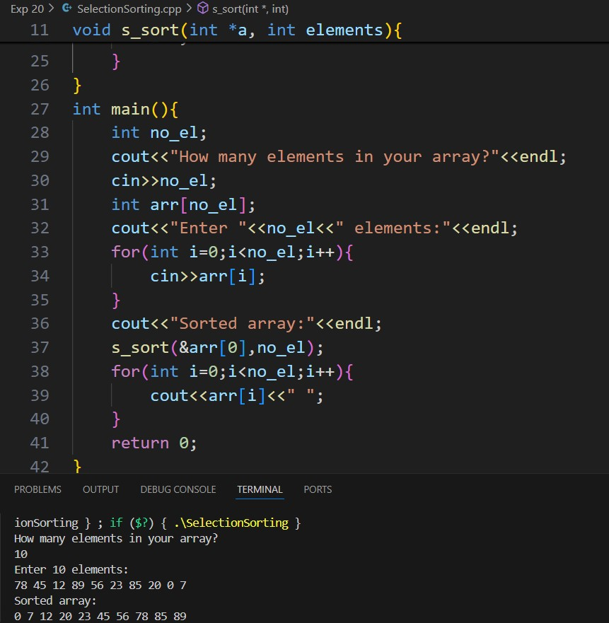
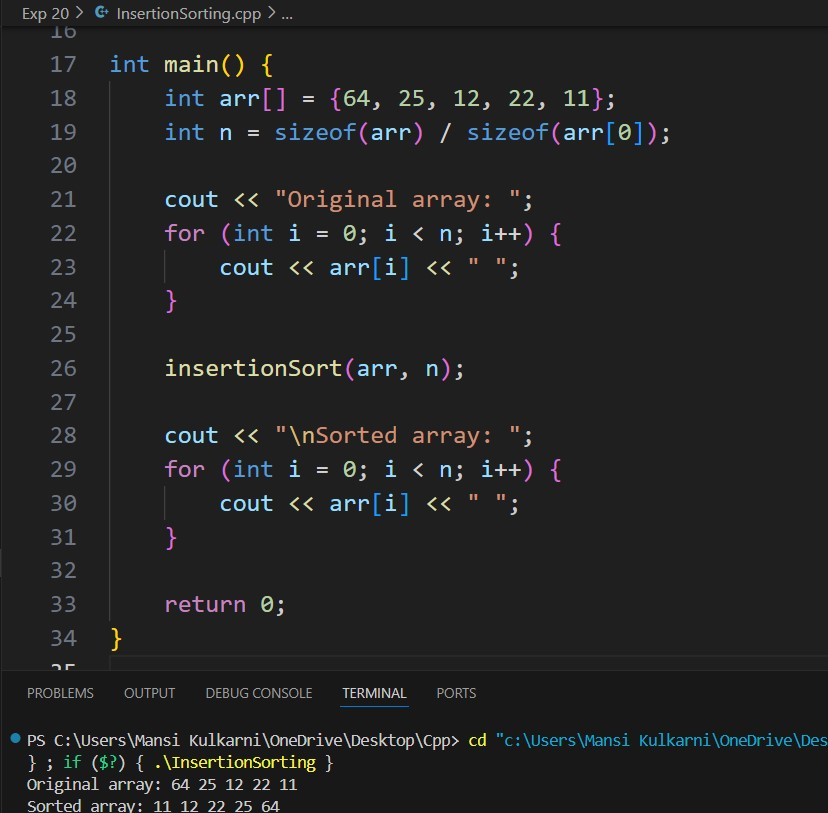
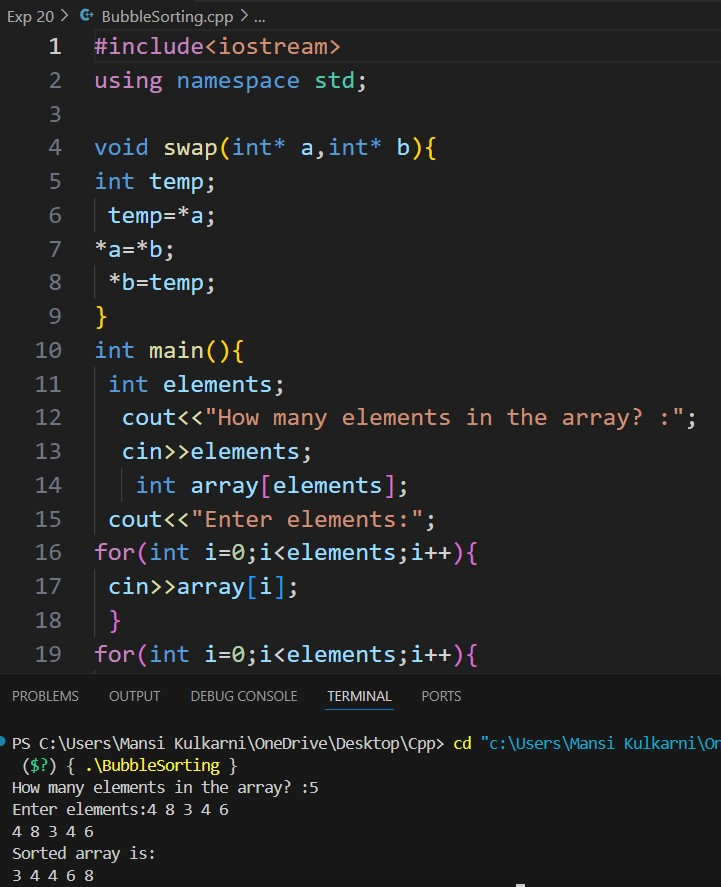

# Experiment 20
A Sorting Algorithm is used to rearrange a given array or list of elements according to a comparison operator on the elements. The comparison operator is used to decide the new order of elements in the respective data structure.
## Program 1
### Aim: 
Write a c++ program to do selection sorting.
### Software used: 
Visual Studio Code
### Theory:
Selection Sort is a comparison-based sorting algorithm. It sorts an array by repeatedly selecting the smallest (or largest) element from the unsorted portion and swapping it with the first unsorted element. This process continues until the entire array is sorted.
### Output:

### Conclusion:
We learnt the selection sorting algorithm in C++. 

## Program 2
### Aim: 
Write a c++ program to do insertion sorting.
### Software used: 
Visual Studio Code
### Theory:
Insertion sort is a simple sorting algorithm that works by iteratively inserting each element of an unsorted list into its correct position in a sorted portion of the list. It is like sorting playing cards in your hands. You split the cards into two groups: the sorted cards and the unsorted cards. Then, you pick a card from the unsorted group and put it in the right place in the sorted group.
### Output:

### Conclusion:
We learnt the insertion sorting algorithm in C++. 

## Program 3
### Aim: 
Write a c++ to do bubble sorting.
### Software used: 
Visual Studio Code
### Theory:
Bubble Sort is the simplest sorting algorithm that works by repeatedly swapping the adjacent elements if they are in the wrong order. This algorithm is not suitable for large data sets as its average and worst-case time complexity are quite high.
### Output:

### Conclusion:
We learnt the bubble sorting algorithm in C++. 
